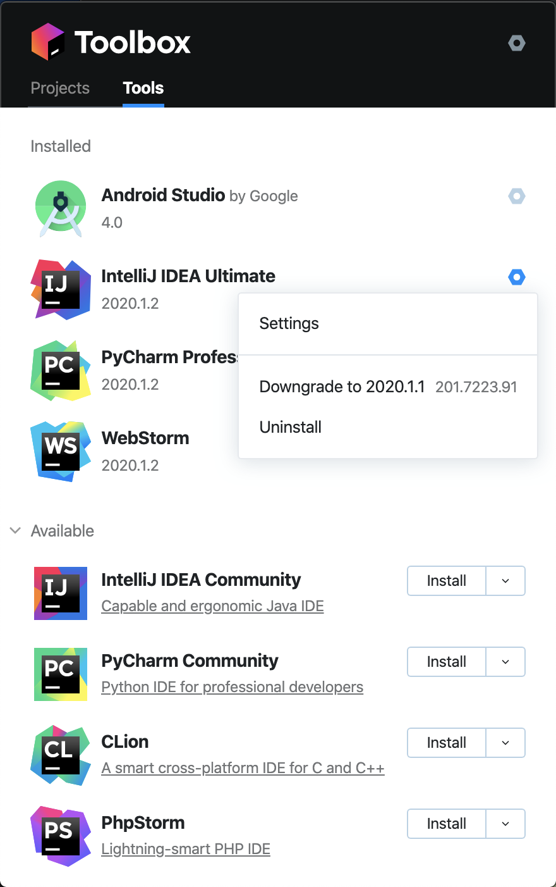
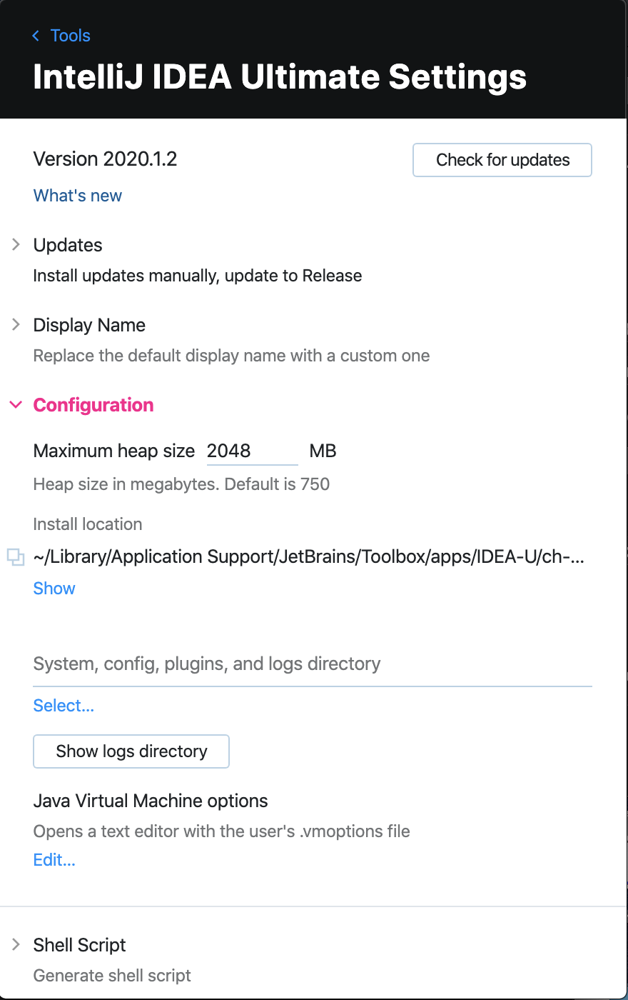

# IntelliJ Change Memory Setting

There're two ways to change memory heap Settings for IntelliJ:

1. Change through IntelliJ directly, or
2. Using JetBrain Toolbox

## Change through IntelliJ directly

Follow the following official doc to change memory heap directly, notice that it's recommended to first update IntelliJ to latest version, to make steps simpler:
https://www.jetbrains.com/help/idea/increasing-memory-heap.html

## Using JetBrain toolbox

JetBrain Toolbox app makes managing JetBrains tools almost effortless. It can help:

- Install
- Update automatically
- Update the plugins together with IDE
- Roll back and downgrade
- Change configs including memory heap

After download and install Toolbox, click the gear button corresponding to IntelliJ, then click `Settings`

At the `Settings` page, click to expand the `configuration` section. Then update the `Maximum Heap Size` to desired value

## How much memory should we set to?

I recommend to set the IntelliJ memory to be 1/3 of your computer full memory (if it's for huge project with many files to index). But for most smaller project, the 2G should be more than enough.
